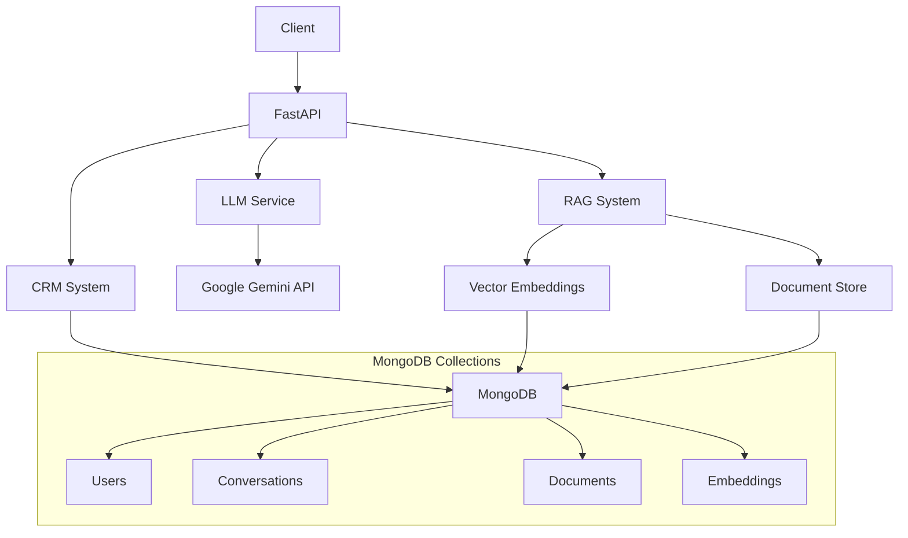

# Multi-Agentic Conversational AI System

A comprehensive Python-based RESTful API application that enables natural language conversation with Large Language Models (LLM), integrated with Retrieval Augmented Generation (RAG) and a custom-built CRM system.

## Features

### 🤖 Conversational AI
- Natural language processing with Hugging Face transformers
- Context-aware responses with conversation memory
- Multi-session support with unique user identification

### 🔍 Retrieval Augmented Generation (RAG)
- Document ingestion (PDF, TXT, CSV, JSON)
- Semantic search with sentence transformers
- Context-enhanced responses using retrieved knowledge

### 🏢 Integrated CRM System
- User profile management
- Conversation history tracking
- Automatic categorization and tagging
- MongoDB-based storage

### 📊 Analytics & Monitoring
- Response time tracking
- Conversation categorization
- User interaction analytics

## Architecture



## Quick Start

### Prerequisites
- Python 3.8+
- MongoDB
- Google Gemini API Key

### Installation

1. **Clone the repository**
```bash
git clone <repository-url>
cd multi-agentic-ai-system
```

2. **Install dependencies**
```bash
pip install -r requirements.txt
```

3. **Set up environment variables**
```bash
cp .env.example .env
# Edit .env with your configuration
```

4. **Start MongoDB**
```bash
# Using Docker
docker run -d -p 27017:27017 --name mongodb mongo:latest

# Or start your local MongoDB service
sudo systemctl start mongod
```

5. **Run the application**
```bash
python main.py
```

The API will be available at `http://localhost:8000`

## API Documentation

### Chat Endpoint
**POST** `/chat`

Send a message and receive an AI-generated response with RAG enhancement.

```json
{
  "message": "What is machine learning?",
  "user_id": "optional-user-id",
  "session_id": "optional-session-id"
}
```

**Response:**
```json
{
  "response": "Machine learning is a subset of artificial intelligence...",
  "user_id": "user-123",
  "session_id": "session-456",
  "timestamp": "2024-01-20T10:30:00Z",
  "processing_time": 1.23,
  "rag_sources": ["document1.pdf", "document2.txt"],
  "conversation_category": "information"
}
```

### Document Upload
**POST** `/upload_docs`

Upload documents to populate the RAG knowledge base.

```bash
curl -X POST "http://localhost:8000/upload_docs" \
  -F "files=@document1.pdf" \
  -F "files=@document2.txt"
```

### CRM Endpoints

#### Create User
**POST** `/crm/create_user`

```json
{
  "name": "John Doe",
  "email": "john@example.com",
  "company": "Tech Corp",
  "preferences": {"language": "en", "timezone": "UTC"}
}
```

#### Update User
**PUT** `/crm/update_user/{user_id}`

```json
{
  "name": "John Smith",
  "company": "New Tech Corp"
}
```

#### Get Conversations
**GET** `/crm/conversations/{user_id}?limit=20`

Returns conversation history for the specified user.

### Reset Conversation
**POST** `/reset`

Clear conversation memory (optionally for specific user).

```json
{
  "user_id": "optional-user-id"
}
```

## Database Schema

### Users Collection
```json
{
  "_id": "user-uuid",
  "name": "John Doe",
  "email": "john@example.com",
  "company": "Tech Corp",
  "preferences": {},
  "created_at": "2024-01-20T10:00:00Z",
  "last_interaction": "2024-01-20T10:30:00Z"
}
```

### Conversations Collection
```json
{
  "user_id": "user-uuid",
  "session_id": "session-uuid",
  "user_message": "What is AI?",
  "bot_response": "Artificial Intelligence is...",
  "timestamp": "2024-01-20T10:30:00Z",
  "category": "information",
  "status": "active"
}
```

### Documents Collection
```json
{
  "_id": "doc-uuid",
  "filename": "document.pdf",
  "type": "pdf",
  "content": "Full document content...",
  "chunks": ["chunk1", "chunk2"],
  "created_at": "2024-01-20T10:00:00Z"
}
```

### Embeddings Collection
```json
{
  "document_id": "doc-uuid",
  "chunk_index": 0,
  "chunk_text": "Text chunk content...",
  "embedding": [0.1, 0.2, 0.3, ...],
  "created_at": "2024-01-20T10:00:00Z"
}
```

## Configuration

### Environment Variables

- `MONGODB_URL`: MongoDB connection string
- `DATABASE_NAME`: Database name
- `GEMINI_API_KEY`: Your Google Gemini API key
- `EMBEDDING_MODEL`: Sentence transformer model for embeddings
- `LLM_MODEL`: Google Gemini model for text generation

### Model Configuration

The system uses:
- **Embedding Model**: `sentence-transformers/all-MiniLM-L6-v2`
- **LLM Model**: `microsoft/DialoGPT-medium`

You can change these in the configuration or environment variables.

## Advanced Features

### Conversation Categorization
Automatic categorization of conversations:
- **support**: Help, support, problem-related queries
- **sales**: Purchase, pricing, cost-related queries
- **information**: General information requests
- **general**: Other conversations

### RAG Enhancement
- Semantic search using sentence transformers
- Document chunking with overlap
- Similarity-based retrieval
- Context integration with LLM prompts

### Session Management
- Unique session IDs for conversation tracking
- User-specific conversation history
- Memory management with configurable limits

## Testing

### Sample API Calls

```bash
# Test chat endpoint
curl -X POST "http://localhost:8000/chat" \
  -H "Content-Type: application/json" \
  -d '{"message": "Hello, how are you?"}'

# Upload documents
curl -X POST "http://localhost:8000/upload_docs" \
  -F "files=@sample.pdf"

# Create user
curl -X POST "http://localhost:8000/crm/create_user" \
  -H "Content-Type: application/json" \
  -d '{"name": "Test User", "email": "test@example.com"}'
```

### Interactive API Documentation
Visit `http://localhost:8000/docs` for interactive Swagger UI documentation.

## Production Deployment

### Docker Deployment
```dockerfile
FROM python:3.9-slim

WORKDIR /app
COPY requirements.txt .
RUN pip install -r requirements.txt

COPY . .
EXPOSE 8000

CMD ["uvicorn", "main:app", "--host", "0.0.0.0", "--port", "8000"]
```

### Security Considerations
- Add API key authentication
- Implement rate limiting
- Use HTTPS in production
- Secure MongoDB with authentication
- Add input validation and sanitization

## Contributing

1. Fork the repository
2. Create a feature branch
3. Commit your changes
4. Push to the branch
5. Create a Pull Request

## License

This project is licensed under the MIT License.

## Support

For questions or issues, please contact the development team or create an issue in the repository.